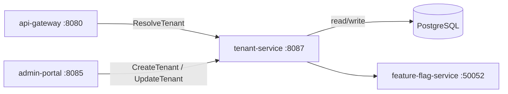

# Tenant Service

> Multi-tenancy management — provisions, configures, and isolates platform tenants.

## Overview

The Tenant Service is the authoritative source for tenant identity and configuration in the ShopOS multi-tenant platform. It manages the full tenant lifecycle from onboarding through suspension and off-boarding, storing per-tenant configuration such as allowed feature flags, custom domain mappings, billing tier, and branding settings. Every inbound request is associated with a tenant via the api-gateway, which resolves tenant context from this service by hostname or header.

## Architecture



## Tech Stack

| Component | Technology |
|---|---|
| Language | Go |
| Database | PostgreSQL |
| Protocol | gRPC |
| Port | 8087 |

## Responsibilities

- Store and serve tenant records including ID, name, status, domain, and tier
- Resolve tenant context from a hostname, subdomain, or `X-Tenant-ID` header
- Manage per-tenant configuration overrides (feature flags, quotas, branding)
- Enforce tenant isolation guarantees — no cross-tenant data leakage
- Support tenant suspension and reactivation with immediate effect
- Emit tenant lifecycle events for downstream services to react to
- Provide tenant lookup caching to minimise per-request latency impact

## API / Interface

### gRPC Methods (`proto/platform/tenant.proto`)

| Method | Type | Description |
|---|---|---|
| `ResolveTenant` | Unary | Resolve tenant from hostname or tenant ID header |
| `GetTenant` | Unary | Fetch full tenant record by ID |
| `CreateTenant` | Unary | Provision a new tenant |
| `UpdateTenant` | Unary | Modify tenant configuration or status |
| `SuspendTenant` | Unary | Immediately suspend a tenant |
| `ListTenants` | Unary | Paginated list of all tenants |
| `GetTenantConfig` | Unary | Fetch per-tenant configuration overrides |

## Kafka Topics

| Topic | Producer/Consumer | Description |
|---|---|---|
| `platform.tenant.created` | Producer | Emitted when a new tenant is provisioned |
| `platform.tenant.suspended` | Producer | Emitted when a tenant is suspended |
| `platform.tenant.deleted` | Producer | Emitted when a tenant is permanently removed |

## Dependencies

Upstream (services this calls):
- `PostgreSQL` — tenant record and configuration storage
- `feature-flag-service` (platform) — per-tenant feature flag overrides

Downstream (services that call this):
- `api-gateway` (platform) — tenant resolution on every request
- `admin-portal` (platform) — tenant lifecycle management
- All multi-tenant-aware services — fetch tenant context to scope data queries

## Environment Variables

| Variable | Default | Description |
|---|---|---|
| `GRPC_PORT` | `8087` | gRPC listening port |
| `DB_HOST` | `postgres` | PostgreSQL host |
| `DB_PORT` | `5432` | PostgreSQL port |
| `DB_NAME` | `tenant_service` | Database name |
| `DB_USER` | `shopos` | Database user |
| `DB_PASSWORD` | `` | Database password (required) |
| `KAFKA_BROKERS` | `kafka:9092` | Comma-separated Kafka broker addresses |
| `CACHE_TTL` | `60s` | In-memory tenant resolution cache TTL |
| `LOG_LEVEL` | `info` | Logging level |

## Running Locally

```bash
# From repo root
docker-compose up tenant-service

# OR hot reload
skaffold dev --module=tenant-service
```

## Health Check

`GET /healthz` → `{"status":"ok"}`
