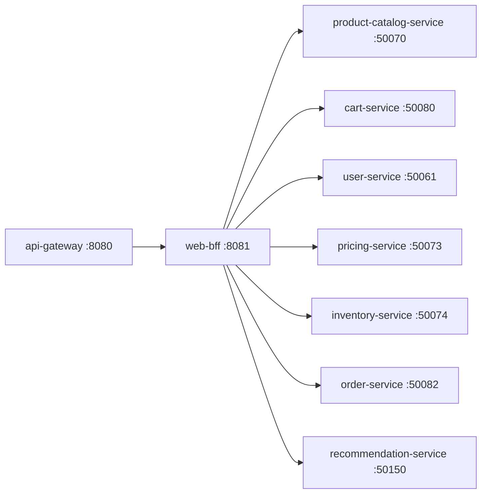

# Web BFF

> Backend-for-Frontend tailored for the ShopOS web application.

## Overview

The Web BFF (Backend-for-Frontend) serves as the dedicated API layer for the ShopOS web client, aggregating data from multiple downstream microservices into web-optimized response shapes. It reduces round trips for the browser by composing catalog, cart, user, and pricing information into single cohesive responses. All requests arrive pre-authenticated via the api-gateway.

## Architecture



## Tech Stack

| Component | Technology |
|---|---|
| Language | Go |
| Database | — |
| Protocol | REST |
| Port | 8081 |

## Responsibilities

- Aggregate product, pricing, and inventory data into a single catalog response for web pages
- Compose cart contents with product details and real-time stock levels
- Serve user profile, order history, and wishlist in combined payloads
- Transform internal gRPC responses into web-friendly JSON structures
- Handle web-specific pagination, sorting, and filtering query parameters
- Forward authentication context from api-gateway to downstream services

## API / Interface

| Method | Path | Description |
|---|---|---|
| GET | `/api/v1/homepage` | Aggregated homepage payload (featured products, recommendations) |
| GET | `/api/v1/products/:id` | Product detail with pricing, inventory, and reviews |
| GET | `/api/v1/cart` | Cart with enriched product details |
| POST | `/api/v1/cart/items` | Add item to cart |
| GET | `/api/v1/account` | User profile with orders and wishlist |
| GET | `/api/v1/orders` | Paginated order history |
| GET | `/healthz` | Health check |

## Kafka Topics

N/A — the Web BFF is a synchronous aggregation layer and does not interact with Kafka directly.

## Dependencies

Upstream (services this calls):
- `product-catalog-service` (catalog) — product data
- `pricing-service` (catalog) — pricing data
- `inventory-service` (catalog) — stock levels
- `cart-service` (commerce) — cart state
- `order-service` (commerce) — order history
- `user-service` (identity) — user profile
- `recommendation-service` (analytics-ai) — personalised recommendations

Downstream (services that call this):
- `api-gateway` (platform) — routes web client traffic here

## Environment Variables

| Variable | Default | Description |
|---|---|---|
| `PORT` | `8081` | HTTP listening port |
| `CATALOG_SERVICE_ADDR` | `product-catalog-service:50070` | Address of product-catalog-service |
| `PRICING_SERVICE_ADDR` | `pricing-service:50073` | Address of pricing-service |
| `INVENTORY_SERVICE_ADDR` | `inventory-service:50074` | Address of inventory-service |
| `CART_SERVICE_ADDR` | `cart-service:50080` | Address of cart-service |
| `ORDER_SERVICE_ADDR` | `order-service:50082` | Address of order-service |
| `USER_SERVICE_ADDR` | `user-service:50061` | Address of user-service |
| `RECOMMENDATION_SERVICE_ADDR` | `recommendation-service:50150` | Address of recommendation-service |
| `LOG_LEVEL` | `info` | Logging level |

## Running Locally

```bash
# From repo root
docker-compose up web-bff

# OR hot reload
skaffold dev --module=web-bff
```

## Health Check

`GET /healthz` → `{"status":"ok"}`
