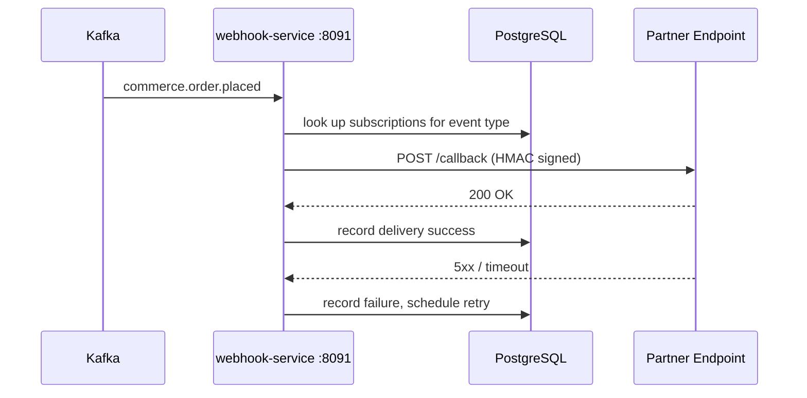

# Webhook Service

> Manages and delivers outbound webhook notifications to registered partner endpoints.

## Overview

The Webhook Service provides a reliable outbound event delivery mechanism for partner integrations and third-party systems subscribed to ShopOS platform events. Partners register HTTP callback URLs via the REST API, and when matching domain events arrive on Kafka, the service delivers signed HTTP POST payloads to those endpoints with automatic retry and exponential back-off. Delivery attempts and outcomes are persisted in Postgres for audit and debugging.

## Architecture



## Tech Stack

| Component | Technology |
|---|---|
| Language | Go |
| Database | PostgreSQL |
| Protocol | HTTP / Kafka |
| Port | 8091 |

## Responsibilities

- Manage partner webhook subscription registrations (URL, event types, secret)
- Consume domain events from Kafka and fan out to matching subscriptions
- Sign outbound payloads with HMAC-SHA256 using per-subscription secrets
- Implement exponential back-off retry with configurable max attempts
- Record every delivery attempt with status, response code, and latency in Postgres
- Expose a delivery history API for partner self-service debugging
- Support manual replay of failed deliveries

## API / Interface

| Method | Path | Description |
|---|---|---|
| POST | `/api/v1/webhooks` | Register a new webhook subscription |
| GET | `/api/v1/webhooks` | List all subscriptions for the calling partner |
| GET | `/api/v1/webhooks/:id` | Get a specific subscription |
| PUT | `/api/v1/webhooks/:id` | Update subscription URL or event filters |
| DELETE | `/api/v1/webhooks/:id` | Remove a subscription |
| GET | `/api/v1/webhooks/:id/deliveries` | Delivery history for a subscription |
| POST | `/api/v1/webhooks/:id/deliveries/:deliveryId/replay` | Replay a failed delivery |
| GET | `/healthz` | Health check |

## Kafka Topics

| Topic | Producer/Consumer | Description |
|---|---|---|
| `commerce.order.placed` | Consumer | Triggers webhook delivery to order-subscribed partners |
| `commerce.order.fulfilled` | Consumer | Triggers webhook delivery on fulfilment |
| `commerce.payment.processed` | Consumer | Triggers webhook delivery on payment |
| `supplychain.shipment.updated` | Consumer | Triggers webhook delivery on shipment update |

## Dependencies

Upstream (services this calls):
- `PostgreSQL` — subscription registry and delivery log storage
- Kafka — source of domain events to fan out

Downstream (services that call this):
- External partner systems — receive webhook POST callbacks
- `admin-portal` (platform) — subscription and delivery management

## Environment Variables

| Variable | Default | Description |
|---|---|---|
| `PORT` | `8091` | HTTP listening port |
| `DB_HOST` | `postgres` | PostgreSQL host |
| `DB_PORT` | `5432` | PostgreSQL port |
| `DB_NAME` | `webhook_service` | Database name |
| `DB_USER` | `shopos` | Database user |
| `DB_PASSWORD` | `` | Database password (required) |
| `KAFKA_BROKERS` | `kafka:9092` | Comma-separated Kafka broker addresses |
| `KAFKA_CONSUMER_GROUP` | `webhook-service` | Kafka consumer group ID |
| `MAX_RETRY_ATTEMPTS` | `5` | Maximum delivery retry attempts |
| `RETRY_INITIAL_BACKOFF` | `5s` | Initial retry back-off duration |
| `LOG_LEVEL` | `info` | Logging level |

## Running Locally

```bash
# From repo root
docker-compose up webhook-service

# OR hot reload
skaffold dev --module=webhook-service
```

## Health Check

`GET /healthz` → `{"status":"ok"}`
