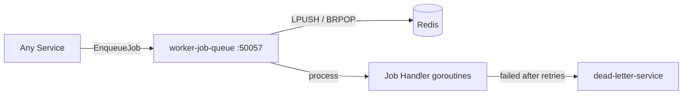

# Worker Job Queue

> Reliable background job processing queue backed by Redis for async task execution.

## Overview

The Worker Job Queue provides a durable, prioritised background job processing system for tasks that should not block synchronous request paths — such as sending emails, generating reports, resizing images, or running batch updates. Jobs are enqueued via gRPC, persisted in Redis queues, and processed by worker goroutines with configurable concurrency. Failed jobs are retried with exponential back-off before being sent to the dead-letter queue.

## Architecture



## Tech Stack

| Component | Technology |
|---|---|
| Language | Go |
| Database | Redis |
| Protocol | gRPC |
| Port | 50057 |

## Responsibilities

- Accept job enqueue requests from any service via gRPC
- Maintain multiple named queues with configurable priority levels
- Process jobs concurrently using a pool of goroutines per queue
- Retry failed jobs with exponential back-off up to a configurable maximum
- Route permanently failed jobs to the dead-letter-service
- Expose queue depth and worker throughput metrics for monitoring
- Support job cancellation and status queries

## API / Interface

### gRPC Methods (`proto/platform/worker_job_queue.proto`)

| Method | Type | Description |
|---|---|---|
| `EnqueueJob` | Unary | Submit a job to a named queue |
| `GetJobStatus` | Unary | Query the status of a submitted job |
| `CancelJob` | Unary | Cancel a pending job |
| `GetQueueStats` | Unary | Retrieve depth and throughput stats for a queue |
| `ListQueues` | Unary | List all active named queues |

## Kafka Topics

N/A — this service uses Redis queues, not Kafka, for job storage and signalling.

## Dependencies

Upstream (services this calls):
- `Redis` — job queue storage and worker coordination
- `dead-letter-service` (platform) — receives permanently failed jobs

Downstream (services that call this):
- `email-service` (communications) — enqueues email delivery jobs
- `image-processing-service` (content) — enqueues image resize jobs
- `data-export-service` (content) — enqueues bulk export jobs
- Any service requiring deferred background processing

## Environment Variables

| Variable | Default | Description |
|---|---|---|
| `GRPC_PORT` | `50057` | gRPC listening port |
| `REDIS_ADDR` | `redis:6379` | Redis server address |
| `REDIS_PASSWORD` | `` | Redis auth password |
| `DEFAULT_WORKER_CONCURRENCY` | `10` | Number of worker goroutines per queue |
| `MAX_RETRY_ATTEMPTS` | `3` | Max retry attempts before dead-lettering |
| `RETRY_INITIAL_BACKOFF` | `10s` | Initial retry back-off duration |
| `DEAD_LETTER_SERVICE_ADDR` | `dead-letter-service:50070` | Address of dead-letter-service |
| `LOG_LEVEL` | `info` | Logging level |

## Running Locally

```bash
# From repo root
docker-compose up worker-job-queue

# OR hot reload
skaffold dev --module=worker-job-queue
```

## Health Check

`GET /healthz` → `{"status":"ok"}`
