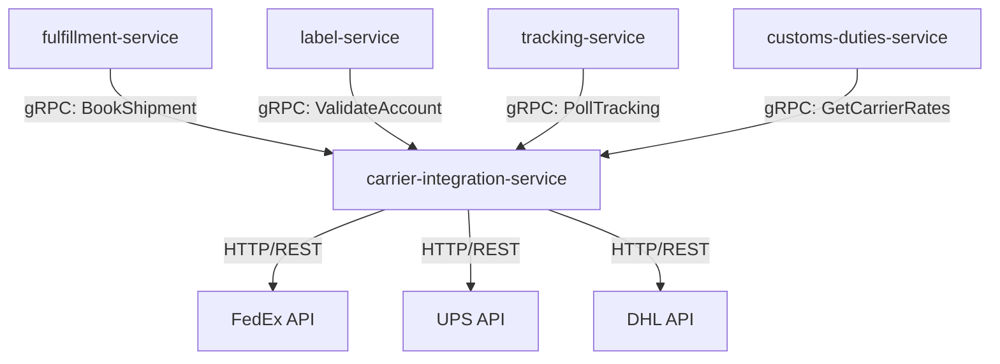

# carrier-integration-service

> Provides a unified adapter layer over carrier APIs (FedEx, UPS, DHL) for rate quoting, booking, and tracking polls.

## Overview

The carrier-integration-service abstracts all direct carrier API communication behind a single gRPC interface. It implements the Adapter pattern for each supported carrier, translating internal ShopOS data models into carrier-specific request/response formats. This isolates all carrier API credentials and SDK dependencies to one service, making it easy to add or replace carrier integrations without touching fulfillment or tracking logic.

## Architecture



## Tech Stack

| Component | Technology |
|---|---|
| Language | Go |
| Protocol | gRPC |
| HTTP client | net/http with retries |
| Build Tool | go build |
| Container | Docker (multi-stage, non-root) |

## Responsibilities

- Rate shopping across configured carriers for a given shipment profile
- Shipment booking and confirmation number retrieval
- On-demand tracking status polls (for webhook gap-filling)
- Account/service validation for label generation
- Carrier credential management via environment variables
- Retry and circuit-breaker logic for unstable carrier APIs
- Extensible adapter registry for adding new carriers

## API / Interface

```protobuf
service CarrierIntegrationService {
  rpc GetRates(GetRatesRequest) returns (GetRatesResponse);
  rpc BookShipment(BookShipmentRequest) returns (BookingConfirmation);
  rpc CancelShipment(CancelShipmentRequest) returns (CancelConfirmation);
  rpc PollTracking(PollTrackingRequest) returns (TrackingStatus);
  rpc ValidateAddress(ValidateAddressRequest) returns (AddressValidationResult);
  rpc ListSupportedServices(ListSupportedServicesRequest) returns (ListSupportedServicesResponse);
}
```

## Kafka Topics

No Kafka topics — this is a synchronous adapter service.

## Dependencies

**Upstream (callers)**
- `fulfillment-service` — shipment booking
- `label-service` — carrier account validation
- `tracking-service` — on-demand tracking polls
- `customs-duties-service` — carrier rate queries for customs cost estimation

**Downstream (calls out to)**
- FedEx Shipping API (external)
- UPS Developer API (external)
- DHL Express API (external)

## Environment Variables

| Variable | Default | Description |
|---|---|---|
| `GRPC_PORT` | `50106` | Port the gRPC server listens on |
| `FEDEX_API_KEY` | — | FedEx API key (required if FedEx enabled) |
| `FEDEX_API_SECRET` | — | FedEx API secret |
| `FEDEX_ACCOUNT_NUMBER` | — | FedEx account number |
| `UPS_CLIENT_ID` | — | UPS OAuth client ID |
| `UPS_CLIENT_SECRET` | — | UPS OAuth client secret |
| `UPS_ACCOUNT_NUMBER` | — | UPS shipper account number |
| `DHL_API_KEY` | — | DHL Express API key |
| `DHL_ACCOUNT_NUMBER` | — | DHL account number |
| `CARRIER_TIMEOUT_SECONDS` | `10` | Per-carrier API call timeout |
| `CARRIER_RETRY_ATTEMPTS` | `3` | Number of retries on transient failures |
| `LOG_LEVEL` | `info` | Logging level |

## Running Locally

```bash
docker-compose up carrier-integration-service
```

## Health Check

`GET /healthz` → `{"status":"ok"}`

gRPC health: `grpc.health.v1.Health/Check` → `SERVING`
