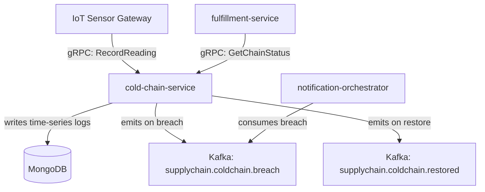

# cold-chain-service

> Tracks temperature and humidity data for perishable goods throughout the supply chain. Alerts when cold-chain integrity is broken.

## Overview

The cold-chain-service is the temperature and environmental monitoring backbone for ShopOS's perishable goods logistics. It ingests time-series sensor readings from IoT devices attached to refrigerated trucks, cold-storage facilities, and packaging units. Every reading is persisted as an immutable log entry in MongoDB. When any reading breaches the configured safe range, the service emits a `supplychain.coldchain.breach` Kafka event so that warehouse operators and fulfillment teams can take corrective action immediately.

## Architecture



## Tech Stack

| Component | Technology |
|---|---|
| Language | Go |
| Database | MongoDB (temperature log storage) |
| Messaging | Kafka (breach/restore alerts) |
| Protocol | gRPC |
| Build Tool | go build |
| Container | Docker (multi-stage, non-root) |

## Responsibilities

- Ingest time-series temperature and humidity sensor readings per shipment/storage unit
- Persist readings as immutable log entries in MongoDB
- Evaluate each reading against configurable min/max thresholds per product category
- Emit `supplychain.coldchain.breach` when a threshold is violated
- Emit `supplychain.coldchain.restored` when readings return within safe range
- Provide chain-of-custody audit trail for regulatory compliance (FDA, HACCP)
- Expose gRPC queries for current environmental status per shipment

## API / Interface

```protobuf
service ColdChainService {
  rpc RecordReading(RecordReadingRequest) returns (ReadingAck);
  rpc GetLatestReading(GetLatestReadingRequest) returns (SensorReading);
  rpc ListReadings(ListReadingsRequest) returns (ListReadingsResponse);
  rpc GetChainStatus(GetChainStatusRequest) returns (ChainStatus);
  rpc SetThreshold(SetThresholdRequest) returns (Threshold);
  rpc GetThreshold(GetThresholdRequest) returns (Threshold);
}
```

## Kafka Topics

| Topic | Direction | Description |
|---|---|---|
| `supplychain.coldchain.breach` | publish | Emitted when a sensor reading violates the safe range |
| `supplychain.coldchain.restored` | publish | Emitted when readings return to the safe range |

## Dependencies

Upstream (callers)
- IoT Sensor Gateway — streams real-time sensor data
- `fulfillment-service` — queries chain status before confirming delivery

Downstream (calls out to)
- None (leaf service for environmental sensor data)

## Environment Variables

| Variable | Default | Description |
|---|---|---|
| `GRPC_PORT` | `50193` | Port the gRPC server listens on |
| `MONGODB_URI` | — | MongoDB connection string (required) |
| `KAFKA_BROKERS` | `localhost:9092` | Comma-separated Kafka broker list |
| `TEMP_MAX_CELSIUS` | `8.0` | Default maximum safe temperature (°C) |
| `TEMP_MIN_CELSIUS` | `-25.0` | Default minimum safe temperature (°C) |
| `HUMIDITY_MAX_PERCENT` | `85` | Default maximum relative humidity (%) |
| `LOG_LEVEL` | `info` | Logging level |

## Running Locally

```bash
docker-compose up cold-chain-service
```

## Health Check

`GET /healthz` → `{"status":"ok"}`

gRPC health: `grpc.health.v1.Health/Check` → `SERVING`
