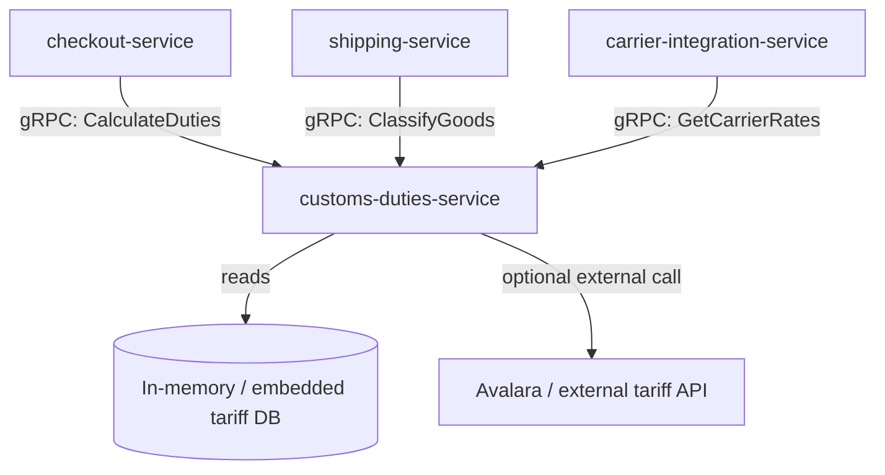

# customs-duties-service

> Classifies goods under HS/HTS tariff codes and calculates applicable customs duties and import taxes for international shipments.

## Overview

The customs-duties-service provides HS code classification and landed-cost calculations for cross-border shipments. It maintains a tariff code database, applies bilateral trade agreement rules, and computes estimated duties and VAT/GST for a destination country. The checkout and shipping services call this service during international order processing to display accurate landed cost estimates to customers before purchase.

## Architecture



## Tech Stack

| Component | Technology |
|---|---|
| Language | Go |
| Protocol | gRPC |
| Tariff data | Embedded JSON/Postgres tariff tables |
| Build Tool | go build |
| Container | Docker (multi-stage, non-root) |

## Responsibilities

- HS (Harmonized System) and HTS code classification for product categories
- Duty rate lookup by HS code, origin country, and destination country
- Import VAT/GST calculation for supported destination markets
- De minimis threshold checking (shipments below threshold skip formal entry)
- Free trade agreement (FTA) preference determination
- Prohibited and restricted goods detection by destination country
- Landed cost breakdown: product + shipping + duties + taxes

## API / Interface

```protobuf
service CustomsDutiesService {
  rpc ClassifyProduct(ClassifyProductRequest) returns (ClassificationResult);
  rpc CalculateDuties(CalculateDutiesRequest) returns (DutiesCalculation);
  rpc GetDeMinimisThreshold(GetDeMinimisRequest) returns (DeMinimisThreshold);
  rpc ListRestrictedItems(ListRestrictedItemsRequest) returns (ListRestrictedItemsResponse);
  rpc GetLandedCost(GetLandedCostRequest) returns (LandedCostBreakdown);
}
```

## Kafka Topics

No Kafka topics — this is a synchronous calculation service.

## Dependencies

Upstream (callers)
- `checkout-service` (commerce domain) — landed cost display at checkout
- `shipping-service` (commerce domain) — customs documentation for international labels
- `carrier-integration-service` — carrier-specific customs rate requirements

Downstream (calls out to)
- External tariff API (optional, e.g., Avalara AvaTax or TaxJar) when `EXTERNAL_TARIFF_API_ENABLED=true`

## Environment Variables

| Variable | Default | Description |
|---|---|---|
| `GRPC_PORT` | `50107` | Port the gRPC server listens on |
| `TARIFF_DB_PATH` | `/data/tariff.json` | Path to embedded tariff data file |
| `EXTERNAL_TARIFF_API_ENABLED` | `false` | Enable external tariff API fallback |
| `EXTERNAL_TARIFF_API_URL` | — | URL for external tariff API |
| `EXTERNAL_TARIFF_API_KEY` | — | API key for external tariff provider |
| `DEFAULT_ORIGIN_COUNTRY` | `US` | ISO 3166-1 alpha-2 default origin country |
| `CACHE_TTL_SECONDS` | `3600` | TTL for duty rate cache entries |
| `LOG_LEVEL` | `info` | Logging level |

## Running Locally

```bash
docker-compose up customs-duties-service
```

## Health Check

`GET /healthz` → `{"status":"ok"}`

gRPC health: `grpc.health.v1.Health/Check` → `SERVING`
