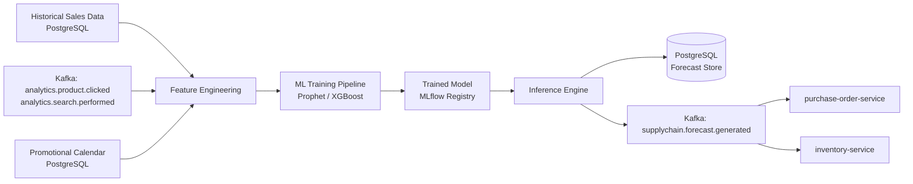

# demand-forecast-service

> Runs ML-based demand forecasting models to predict future inventory needs and publishes forecast events to Kafka.

## Overview

The demand-forecast-service applies time-series and machine learning models to historical sales, seasonality, and promotional data to generate per-SKU demand forecasts. Forecasts are stored in PostgreSQL and published to Kafka so that the warehouse, purchase-order, and inventory services can trigger proactive replenishment actions. The service runs both scheduled batch jobs and on-demand forecast refreshes.

## Architecture



## Tech Stack

| Component | Technology |
|---|---|
| Language | Python 3.12 |
| ML frameworks | Prophet, XGBoost, scikit-learn |
| Model registry | MLflow |
| Database | PostgreSQL |
| Protocol | Kafka (async) |
| Scheduler | APScheduler |
| Build Tool | pip / requirements.txt |
| Container | Docker (multi-stage, non-root) |

## Responsibilities

- Feature engineering from sales history, seasonality indices, and marketing calendars
- Training and re-training of time-series forecasting models (Prophet) and gradient-boosted models (XGBoost)
- Per-SKU and per-category demand forecast generation at daily/weekly/monthly granularity
- Forecast accuracy tracking (MAPE, RMSE) against actuals
- Automated model re-training trigger when accuracy degrades beyond threshold
- Publishing forecast results to Kafka for downstream replenishment actions

## API / Interface

This service is Kafka-driven. It does not expose a gRPC endpoint.

Scheduled job triggers (via APScheduler):
- Daily forecast refresh: `0 2 * * *`
- Weekly model re-training: `0 3 * * 0`

## Kafka Topics

| Topic | Direction | Description |
|---|---|---|
| `analytics.product.clicked` | consume | Click signals used as demand proxy features |
| `supplychain.inventory.low` | consume | Triggers on-demand forecast for low-stock SKUs |
| `supplychain.forecast.generated` | publish | Per-SKU forecast results with confidence intervals |
| `supplychain.forecast.accuracy` | publish | Model accuracy metrics after actuals comparison |

## Dependencies

Upstream (callers)
- Kafka events from `analytics-service` and `warehouse-service`

Downstream (calls out to)
- `ml-feature-store` (analytics-ai domain) — reads pre-computed features
- `inventory-service` (catalog domain) — reads current stock levels as forecast input

## Environment Variables

| Variable | Default | Description |
|---|---|---|
| `DB_HOST` | `localhost` | PostgreSQL host |
| `DB_PORT` | `5432` | PostgreSQL port |
| `DB_NAME` | `forecast_db` | Database name |
| `DB_USER` | `forecast_svc` | Database user |
| `DB_PASSWORD` | — | Database password (required) |
| `KAFKA_BROKERS` | `localhost:9092` | Comma-separated Kafka broker list |
| `MLFLOW_TRACKING_URI` | `http://mlflow:5000` | MLflow tracking server URI |
| `FORECAST_HORIZON_DAYS` | `30` | Number of days ahead to forecast |
| `RETRAIN_MAPE_THRESHOLD` | `0.15` | MAPE threshold that triggers re-training |
| `FEATURE_STORE_GRPC_ADDR` | `ml-feature-store:50152` | Address of ml-feature-store |
| `LOG_LEVEL` | `INFO` | Logging level |

## Running Locally

```bash
docker-compose up demand-forecast-service
```

## Health Check

`GET /healthz` → `{"status":"ok"}`
