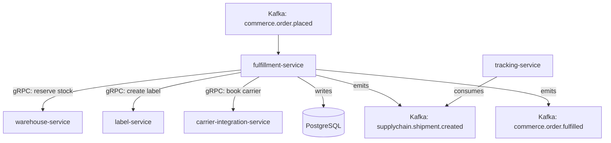

# fulfillment-service

> Orchestrates the pick, pack, and ship workflow for customer orders, with SLA tracking at each stage.

## Overview

The fulfillment-service drives the physical execution of a customer order after payment confirmation. It creates fulfillment tasks, assigns them to warehouse workers, tracks SLA compliance at each stage (pick → pack → handoff to carrier), and triggers shipment creation once an order is ready for dispatch. It acts as the coordination hub between the commerce, warehouse, and shipping domains.

## Architecture



## Tech Stack

| Component | Technology |
|---|---|
| Language | Go |
| Database | PostgreSQL |
| Protocol | gRPC |
| Migrations | golang-migrate |
| Build Tool | go build |
| Container | Docker (multi-stage, non-root) |

## Responsibilities

- Fulfillment task creation and assignment from inbound order events
- Pick list generation optimized by bin location
- Pack confirmation with weight and dimension capture
- SLA tracking and breach alerting at pick, pack, and dispatch stages
- Partial fulfillment and split shipment handling
- Handoff to `carrier-integration-service` for booking and label attachment

## API / Interface

```protobuf
service FulfillmentService {
  rpc CreateFulfillmentTask(CreateFulfillmentTaskRequest) returns (FulfillmentTask);
  rpc GetFulfillmentTask(GetFulfillmentTaskRequest) returns (FulfillmentTask);
  rpc ListFulfillmentTasks(ListFulfillmentTasksRequest) returns (ListFulfillmentTasksResponse);
  rpc ConfirmPick(ConfirmPickRequest) returns (FulfillmentTask);
  rpc ConfirmPack(ConfirmPackRequest) returns (FulfillmentTask);
  rpc DispatchShipment(DispatchShipmentRequest) returns (FulfillmentTask);
  rpc GetSLAStatus(GetSLAStatusRequest) returns (SLAStatus);
}
```

## Kafka Topics

| Topic | Direction | Description |
|---|---|---|
| `commerce.order.placed` | consume | Triggers fulfillment task creation |
| `commerce.order.cancelled` | consume | Cancels in-progress fulfillment |
| `supplychain.shipment.created` | publish | Emitted when shipment is dispatched |
| `commerce.order.fulfilled` | publish | Emitted when all items for an order are shipped |

## Dependencies

Upstream (callers)
- Order events via Kafka (`commerce.order.placed`)

Downstream (calls out to)
- `warehouse-service` — stock reservation and pick location lookup
- `label-service` — generate shipping label for the packed box
- `carrier-integration-service` — book carrier collection slot

## Environment Variables

| Variable | Default | Description |
|---|---|---|
| `GRPC_PORT` | `50103` | Port the gRPC server listens on |
| `DB_HOST` | `localhost` | PostgreSQL host |
| `DB_PORT` | `5432` | PostgreSQL port |
| `DB_NAME` | `fulfillment_db` | Database name |
| `DB_USER` | `fulfillment_svc` | Database user |
| `DB_PASSWORD` | — | Database password (required) |
| `KAFKA_BROKERS` | `localhost:9092` | Comma-separated Kafka broker list |
| `WAREHOUSE_GRPC_ADDR` | `warehouse-service:50102` | Address of warehouse-service |
| `LABEL_GRPC_ADDR` | `label-service:50105` | Address of label-service |
| `CARRIER_GRPC_ADDR` | `carrier-integration-service:50106` | Address of carrier-integration-service |
| `PICK_SLA_MINUTES` | `30` | SLA for pick stage in minutes |
| `PACK_SLA_MINUTES` | `20` | SLA for pack stage in minutes |
| `LOG_LEVEL` | `info` | Logging level |

## Running Locally

```bash
docker-compose up fulfillment-service
```

## Health Check

`GET /healthz` → `{"status":"ok"}`

gRPC health: `grpc.health.v1.Health/Check` → `SERVING`
