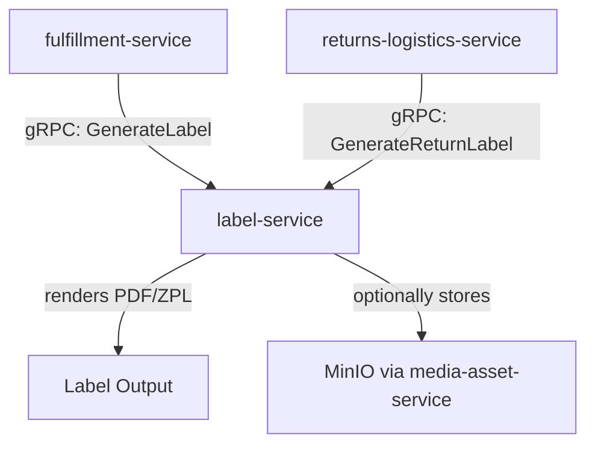

# label-service

> Generates shipping labels in PDF and ZPL formats and produces scannable barcodes for logistics operations.

## Overview

The label-service provides on-demand label generation for the fulfillment workflow. It accepts shipment data and carrier parameters, renders a compliant shipping label in the requested format (PDF for desktop printers, ZPL for thermal Zebra printers), and embeds 1D/2D barcodes as needed. Label templates are carrier-specific and compliant with carrier formatting standards.

## Architecture



## Tech Stack

| Component | Technology |
|---|---|
| Language | Python 3.12 |
| Protocol | gRPC |
| PDF rendering | ReportLab / WeasyPrint |
| ZPL rendering | Custom ZPL template engine |
| Barcode generation | python-barcode / qrcode |
| Build Tool | pip / requirements.txt |
| Container | Docker (multi-stage, non-root) |

## Responsibilities

- Shipping label generation in PDF and ZPL formats
- Carrier-compliant label layouts (FedEx, UPS, DHL, Royal Mail, custom)
- Barcode and QR code generation (Code128, QR, DataMatrix)
- Return label generation for reverse logistics
- Bulk label generation for multi-parcel shipments
- Label archival by forwarding to `media-asset-service` (optional)

## API / Interface

```protobuf
service LabelService {
  rpc GenerateShippingLabel(GenerateLabelRequest) returns (LabelResponse);
  rpc GenerateReturnLabel(GenerateReturnLabelRequest) returns (LabelResponse);
  rpc GenerateBulkLabels(GenerateBulkLabelsRequest) returns (stream LabelResponse);
  rpc GenerateBarcode(GenerateBarcodeRequest) returns (BarcodeResponse);
  rpc GetSupportedCarriers(google.protobuf.Empty) returns (SupportedCarriersResponse);
}
```

## Kafka Topics

No Kafka topics — this is a synchronous request/response service.

## Dependencies

**Upstream (callers)**
- `fulfillment-service` — outbound shipping labels
- `returns-logistics-service` — return/prepaid labels

**Downstream (calls out to)**
- `media-asset-service` (content domain) — optional label archival to MinIO
- `carrier-integration-service` — carrier account validation for label compliance

## Environment Variables

| Variable | Default | Description |
|---|---|---|
| `GRPC_PORT` | `50105` | Port the gRPC server listens on |
| `CARRIER_GRPC_ADDR` | `carrier-integration-service:50106` | Address of carrier-integration-service |
| `MEDIA_ASSET_GRPC_ADDR` | `media-asset-service:50140` | Address of media-asset-service |
| `LABEL_ARCHIVE_ENABLED` | `false` | Whether to archive labels to MinIO |
| `DEFAULT_LABEL_FORMAT` | `PDF` | Default output format (PDF or ZPL) |
| `LOG_LEVEL` | `INFO` | Logging level |

## Running Locally

```bash
docker-compose up label-service
```

## Health Check

`GET /healthz` → `{"status":"ok"}`

gRPC health: `grpc.health.v1.Health/Check` → `SERVING`
