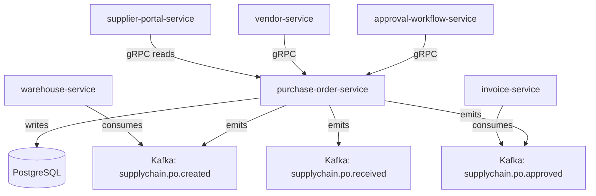

# purchase-order-service

> Creates, routes for approval, and tracks the lifecycle of purchase orders sent to vendors.

## Overview

The purchase-order-service manages the full PO lifecycle from draft creation through multi-level approval to fulfilment confirmation. It enforces configurable approval thresholds, integrates with vendor data for validation, and emits domain events so downstream warehouse and financial services can react to PO state changes. All PO state transitions are persisted with a full audit trail.

## Architecture



## Tech Stack

| Component | Technology |
|---|---|
| Language | Kotlin / Spring Boot 3 |
| Database | PostgreSQL |
| Protocol | gRPC |
| Migrations | Flyway |
| Build Tool | Gradle (Kotlin DSL) |
| Container | Docker (multi-stage, non-root) |

## Responsibilities

- Draft, submit, and manage purchase orders with line-item detail
- Multi-level approval workflow (configurable by PO value threshold)
- PO versioning and change-order management
- Goods-received confirmation and partial receipt tracking
- Expiry and cancellation handling with reason codes

## API / Interface

```protobuf
service PurchaseOrderService {
  rpc CreatePurchaseOrder(CreatePORequest) returns (PurchaseOrder);
  rpc GetPurchaseOrder(GetPORequest) returns (PurchaseOrder);
  rpc ListPurchaseOrders(ListPOsRequest) returns (ListPOsResponse);
  rpc SubmitForApproval(SubmitPORequest) returns (PurchaseOrder);
  rpc ApprovePurchaseOrder(ApprovePORequest) returns (PurchaseOrder);
  rpc RejectPurchaseOrder(RejectPORequest) returns (PurchaseOrder);
  rpc ReceiveGoods(ReceiveGoodsRequest) returns (PurchaseOrder);
  rpc CancelPurchaseOrder(CancelPORequest) returns (PurchaseOrder);
}
```

## Kafka Topics

| Topic | Direction | Description |
|---|---|---|
| `supplychain.po.created` | publish | New PO submitted to a vendor |
| `supplychain.po.approved` | publish | PO approved, ready for vendor fulfilment |
| `supplychain.po.received` | publish | Goods received against a PO |
| `supplychain.po.cancelled` | publish | PO cancelled before fulfilment |

## Dependencies

**Upstream (callers)**
- `approval-workflow-service` (b2b domain) — drives approval state machine
- `supplier-portal-service` — vendor-facing PO reads

**Downstream (calls out to)**
- `vendor-service` — validates vendor exists and is active
- `inventory-service` (catalog domain) — updates expected stock on PO approval

## Environment Variables

| Variable | Default | Description |
|---|---|---|
| `GRPC_PORT` | `50101` | Port the gRPC server listens on |
| `DB_HOST` | `localhost` | PostgreSQL host |
| `DB_PORT` | `5432` | PostgreSQL port |
| `DB_NAME` | `purchase_order_db` | Database name |
| `DB_USER` | `po_svc` | Database user |
| `DB_PASSWORD` | — | Database password (required) |
| `KAFKA_BROKERS` | `localhost:9092` | Comma-separated Kafka broker list |
| `VENDOR_GRPC_ADDR` | `vendor-service:50100` | Address of vendor-service |
| `APPROVAL_VALUE_THRESHOLD` | `10000` | PO value (USD cents) requiring L2 approval |
| `LOG_LEVEL` | `INFO` | Logging level |

## Running Locally

```bash
docker-compose up purchase-order-service
```

## Health Check

`GET /healthz` → `{"status":"ok"}`

gRPC health: `grpc.health.v1.Health/Check` → `SERVING`
