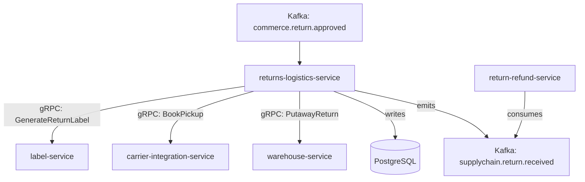

# returns-logistics-service

> Manages reverse logistics for customer returns, including return shipment scheduling, label issuance, and receipt confirmation.

## Overview

The returns-logistics-service handles the operational side of the returns process. When a return request is approved by `return-refund-service` (commerce domain), this service schedules a reverse carrier pickup or generates a prepaid return label, tracks the inbound shipment, and confirms receipt at the warehouse. It feeds completion events back to the commerce domain to trigger refund processing.

## Architecture



## Tech Stack

| Component | Technology |
|---|---|
| Language | Go |
| Database | PostgreSQL |
| Protocol | gRPC |
| Migrations | golang-migrate |
| Build Tool | go build |
| Container | Docker (multi-stage, non-root) |

## Responsibilities

- Return merchandise authorization (RMA) record creation and management
- Prepaid return label generation (via `label-service`)
- Carrier pickup scheduling for home collection returns
- Inbound tracking of return shipments
- Warehouse receipt confirmation and condition assessment recording
- Routing received returns to restock, quarantine, or disposal workflows
- SLA tracking for return transit and receipt

## API / Interface

```protobuf
service ReturnsLogisticsService {
  rpc CreateReturnShipment(CreateReturnShipmentRequest) returns (ReturnShipment);
  rpc GetReturnShipment(GetReturnShipmentRequest) returns (ReturnShipment);
  rpc ListReturnShipments(ListReturnShipmentsRequest) returns (ListReturnShipmentsResponse);
  rpc SchedulePickup(SchedulePickupRequest) returns (PickupConfirmation);
  rpc ConfirmReceipt(ConfirmReceiptRequest) returns (ReturnShipment);
  rpc UpdateReturnDisposition(UpdateDispositionRequest) returns (ReturnShipment);
}
```

## Kafka Topics

| Topic | Direction | Description |
|---|---|---|
| `commerce.return.approved` | consume | Triggers return shipment creation |
| `supplychain.return.in_transit` | publish | Return shipment collected and in transit |
| `supplychain.return.received` | publish | Return physically received at warehouse |

## Dependencies

**Upstream (callers)**
- `return-refund-service` (commerce domain) via Kafka `commerce.return.approved`

**Downstream (calls out to)**
- `label-service` — generate prepaid return labels
- `carrier-integration-service` — schedule carrier pickup
- `warehouse-service` — putaway of received return items

## Environment Variables

| Variable | Default | Description |
|---|---|---|
| `GRPC_PORT` | `50108` | Port the gRPC server listens on |
| `DB_HOST` | `localhost` | PostgreSQL host |
| `DB_PORT` | `5432` | PostgreSQL port |
| `DB_NAME` | `returns_logistics_db` | Database name |
| `DB_USER` | `returns_svc` | Database user |
| `DB_PASSWORD` | — | Database password (required) |
| `KAFKA_BROKERS` | `localhost:9092` | Comma-separated Kafka broker list |
| `LABEL_GRPC_ADDR` | `label-service:50105` | Address of label-service |
| `CARRIER_GRPC_ADDR` | `carrier-integration-service:50106` | Address of carrier-integration-service |
| `WAREHOUSE_GRPC_ADDR` | `warehouse-service:50102` | Address of warehouse-service |
| `RETURN_TRANSIT_SLA_DAYS` | `7` | Max days allowed for return transit |
| `LOG_LEVEL` | `info` | Logging level |

## Running Locally

```bash
docker-compose up returns-logistics-service
```

## Health Check

`GET /healthz` → `{"status":"ok"}`

gRPC health: `grpc.health.v1.Health/Check` → `SERVING`
