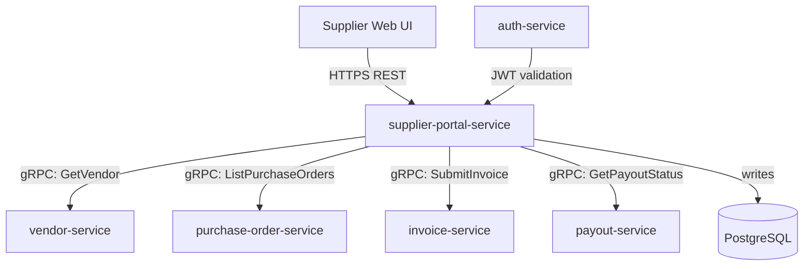

# supplier-portal-service

> Supplier-facing HTTP API that gives vendors visibility into their purchase orders and enables invoice submission.

## Overview

The supplier-portal-service is the external-facing API consumed by the supplier web portal UI. It aggregates and exposes a read-optimized view of purchase orders, delivery schedules, and payment status for authenticated vendors. It also accepts invoice submissions from suppliers and forwards them to the `invoice-service` in the financial domain for processing. Authentication is delegated to the identity domain.

## Architecture



## Tech Stack

| Component | Technology |
|---|---|
| Language | Java 21 / Spring Boot 3 |
| Database | PostgreSQL (portal sessions, submitted invoices cache) |
| Protocol | HTTP/REST |
| Auth | JWT (validated via `auth-service`) |
| Migrations | Flyway |
| Build Tool | Maven |
| Container | Docker (multi-stage, non-root) |

## Responsibilities

- Supplier authentication token validation and session management
- Read-optimized PO list and detail views for vendor-scoped access
- Delivery schedule and shipment status aggregation
- Invoice document upload and submission to `invoice-service`
- Payment and payout status visibility
- Notification preferences management for vendors
- Rate limiting per vendor account

## API / Interface

REST endpoints (HTTP):

| Method | Path | Description |
|---|---|---|
| `GET` | `/api/v1/purchase-orders` | List vendor's purchase orders |
| `GET` | `/api/v1/purchase-orders/{id}` | Get PO detail |
| `POST` | `/api/v1/invoices` | Submit a new invoice against a PO |
| `GET` | `/api/v1/invoices` | List submitted invoices |
| `GET` | `/api/v1/payouts` | List payout transactions |
| `GET` | `/api/v1/profile` | Get vendor profile |
| `PUT` | `/api/v1/profile` | Update vendor profile fields |

## Kafka Topics

No Kafka topics — this is a synchronous REST API service.

## Dependencies

Upstream (callers)
- Supplier web portal (external UI)
- `auth-service` (identity domain) — JWT validation

Downstream (calls out to)
- `vendor-service` — vendor profile reads
- `purchase-order-service` — PO list and detail
- `invoice-service` (financial domain) — invoice submission
- `payout-service` (financial domain) — payout status

## Environment Variables

| Variable | Default | Description |
|---|---|---|
| `HTTP_PORT` | `8088` | Port the HTTP server listens on |
| `DB_HOST` | `localhost` | PostgreSQL host |
| `DB_PORT` | `5432` | PostgreSQL port |
| `DB_NAME` | `supplier_portal_db` | Database name |
| `DB_USER` | `supplier_portal_svc` | Database user |
| `DB_PASSWORD` | — | Database password (required) |
| `AUTH_GRPC_ADDR` | `auth-service:50060` | Address of auth-service for JWT validation |
| `VENDOR_GRPC_ADDR` | `vendor-service:50100` | Address of vendor-service |
| `PO_GRPC_ADDR` | `purchase-order-service:50101` | Address of purchase-order-service |
| `INVOICE_GRPC_ADDR` | `invoice-service:50110` | Address of invoice-service |
| `PAYOUT_GRPC_ADDR` | `payout-service:50112` | Address of payout-service |
| `RATE_LIMIT_RPM` | `300` | Requests per minute per vendor |
| `LOG_LEVEL` | `INFO` | Logging level |

## Running Locally

```bash
docker-compose up supplier-portal-service
```

## Health Check

`GET /healthz` → `{"status":"ok"}`
