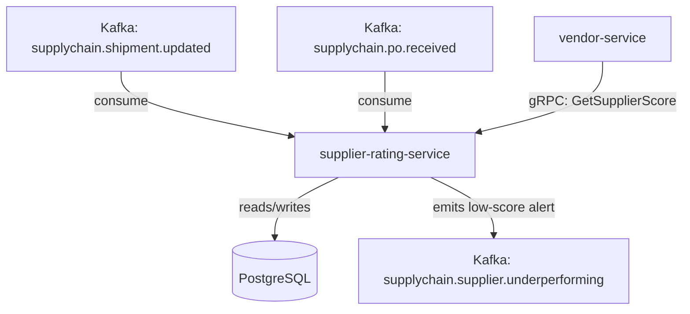

# supplier-rating-service

> Tracks and scores supplier performance across on-time delivery rate, defect rate, fill rate, and lead time accuracy.

## Overview

The supplier-rating-service provides a continuous, data-driven scorecard for every supplier in the ShopOS supply chain. It consumes purchase order and shipment events from Kafka and aggregates performance metrics across four key dimensions: on-time delivery rate, defect/rejection rate, fill rate, and lead time accuracy. Scores are weighted, normalised to a 0–100 composite, and persisted in PostgreSQL. Vendor managers and the vendor-service query this service to surface scorecards, trigger supplier reviews, and feed automated disqualification workflows.

## Architecture



## Tech Stack

| Component | Technology |
|---|---|
| Language | Go |
| Database | PostgreSQL |
| Protocol | gRPC |
| Migrations | golang-migrate |
| Build Tool | go build |
| Container | Docker (multi-stage, non-root) |

## Responsibilities

- Consume shipment and purchase order events to record delivery outcomes
- Calculate rolling KPIs: on-time delivery rate, defect rate, fill rate, lead time accuracy
- Compute a weighted composite score (0–100) per supplier per configurable period
- Persist score history for trend analysis and audit
- Emit `supplychain.supplier.underperforming` when composite score falls below threshold
- Expose gRPC endpoints for scorecard queries, score history, and manual adjustment

## API / Interface

```protobuf
service SupplierRatingService {
  rpc GetSupplierScore(GetSupplierScoreRequest) returns (SupplierScore);
  rpc ListSupplierScores(ListSupplierScoresRequest) returns (ListSupplierScoresResponse);
  rpc GetScoreHistory(GetScoreHistoryRequest) returns (ScoreHistoryResponse);
  rpc RecordDeliveryOutcome(DeliveryOutcomeRequest) returns (google.protobuf.Empty);
  rpc RecordDefectReport(DefectReportRequest) returns (google.protobuf.Empty);
  rpc SetScoringWeights(SetScoringWeightsRequest) returns (ScoringWeights);
}
```

## Kafka Topics

| Topic | Direction | Description |
|---|---|---|
| `supplychain.shipment.updated` | consume | Delivery outcome signals (on-time / late / partial) |
| `supplychain.po.received` | consume | Goods receipt for fill-rate calculation |
| `supplychain.supplier.underperforming` | publish | Emitted when composite score drops below threshold |

## Dependencies

Upstream (callers)
- `vendor-service` — queries supplier scorecard for approval workflows
- `purchase-order-service` — triggers score recalculation on PO closure

Downstream (calls out to)
- None (leaf scoring service)

## Environment Variables

| Variable | Default | Description |
|---|---|---|
| `GRPC_PORT` | `50194` | Port the gRPC server listens on |
| `DATABASE_URL` | — | PostgreSQL connection string (required) |
| `WEIGHT_ON_TIME_DELIVERY` | `0.35` | Scoring weight for on-time delivery |
| `WEIGHT_DEFECT_RATE` | `0.30` | Scoring weight for defect/rejection rate |
| `WEIGHT_FILL_RATE` | `0.20` | Scoring weight for order fill rate |
| `WEIGHT_LEAD_TIME_ACCURACY` | `0.15` | Scoring weight for lead time accuracy |
| `LOG_LEVEL` | `info` | Logging level |

## Running Locally

```bash
docker-compose up supplier-rating-service
```

## Health Check

`GET /healthz` → `{"status":"ok"}`

gRPC health: `grpc.health.v1.Health/Check` → `SERVING`
