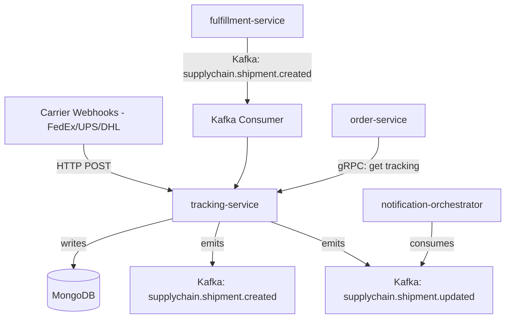

# tracking-service

> Ingests carrier webhook events and maintains a real-time shipment tracking event timeline.

## Overview

The tracking-service is the single source of truth for shipment location and status. It receives tracking updates from carrier webhooks, normalizes them into a unified event model, and persists them in MongoDB for efficient timeline queries. It publishes `supplychain.shipment.created` and `supplychain.shipment.updated` events to Kafka so that the order, notification, and customer-experience domains can react to delivery progress in real time.

## Architecture



## Tech Stack

| Component | Technology |
|---|---|
| Language | Node.js (Express) |
| Database | MongoDB |
| Protocol | gRPC + HTTP (webhook ingestion) |
| Build Tool | npm |
| Container | Docker (multi-stage, non-root) |

## Responsibilities

- Carrier webhook endpoint for FedEx, UPS, DHL, and custom carrier adapters
- Normalization of carrier-specific event payloads into a unified `TrackingEvent` schema
- Immutable tracking timeline storage per shipment
- Estimated delivery date calculation and updates
- gRPC API for order and customer-facing timeline queries
- Publishing unified events to Kafka for downstream consumers

## API / Interface

```protobuf
service TrackingService {
  rpc GetShipment(GetShipmentRequest) returns (Shipment);
  rpc GetTrackingTimeline(GetTrackingTimelineRequest) returns (TrackingTimeline);
  rpc ListShipmentsByOrder(ListShipmentsByOrderRequest) returns (ListShipmentsResponse);
  rpc RegisterShipment(RegisterShipmentRequest) returns (Shipment);
  rpc UpdateEstimatedDelivery(UpdateEDDRequest) returns (Shipment);
}
```

Webhook endpoint (HTTP):
- `POST /webhooks/carrier/{carrier-id}` — receives raw carrier tracking payloads

## Kafka Topics

| Topic | Direction | Description |
|---|---|---|
| `supplychain.shipment.created` | publish | New shipment registered and first scan received |
| `supplychain.shipment.updated` | publish | Any subsequent tracking event (in-transit, out-for-delivery, delivered, exception) |

## Dependencies

Upstream (callers)
- Carrier systems via HTTP webhooks
- `fulfillment-service` — shipment registration trigger via Kafka

Downstream (calls out to)
- `carrier-integration-service` — for on-demand tracking polls when webhooks are delayed

## Environment Variables

| Variable | Default | Description |
|---|---|---|
| `GRPC_PORT` | `50104` | Port the gRPC server listens on |
| `HTTP_PORT` | `3000` | Port for carrier webhook HTTP server |
| `MONGODB_URI` | `mongodb://localhost:27017/tracking` | MongoDB connection string |
| `KAFKA_BROKERS` | `localhost:9092` | Comma-separated Kafka broker list |
| `CARRIER_GRPC_ADDR` | `carrier-integration-service:50106` | Address of carrier-integration-service |
| `WEBHOOK_SECRET_FEDEX` | — | Shared secret for FedEx webhook validation |
| `WEBHOOK_SECRET_UPS` | — | Shared secret for UPS webhook validation |
| `WEBHOOK_SECRET_DHL` | — | Shared secret for DHL webhook validation |
| `LOG_LEVEL` | `info` | Logging level |

## Running Locally

```bash
docker-compose up tracking-service
```

## Health Check

`GET /healthz` → `{"status":"ok"}`

gRPC health: `grpc.health.v1.Health/Check` → `SERVING`
