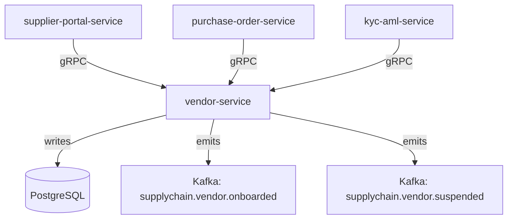

# vendor-service

> Manages vendor onboarding, profiles, contracts, and performance metrics across the supply chain.

## Overview

The vendor-service is the authoritative source of record for all supplier and vendor entities on the ShopOS platform. It handles the full vendor lifecycle: onboarding, document verification, contract linking, and ongoing performance scoring. Downstream supply-chain services rely on vendor data to associate purchase orders, shipments, and invoices with the correct supplier.

## Architecture



## Tech Stack

| Component | Technology |
|---|---|
| Language | Java 21 / Spring Boot 3 |
| Database | PostgreSQL |
| Protocol | gRPC |
| Migrations | Flyway |
| Build Tool | Maven |
| Container | Docker (multi-stage, non-root) |

## Responsibilities

- Vendor registration and profile management (contact info, certifications, bank details)
- Document upload tracking and verification status
- Performance metrics aggregation (on-time delivery rate, defect rate, fill rate)
- Vendor tier classification (preferred, approved, probationary, suspended)
- Integration point for KYC/AML checks via `kyc-aml-service`

## API / Interface

```protobuf
service VendorService {
  rpc CreateVendor(CreateVendorRequest) returns (Vendor);
  rpc GetVendor(GetVendorRequest) returns (Vendor);
  rpc UpdateVendor(UpdateVendorRequest) returns (Vendor);
  rpc SuspendVendor(SuspendVendorRequest) returns (Vendor);
  rpc ListVendors(ListVendorsRequest) returns (ListVendorsResponse);
  rpc GetVendorPerformance(GetVendorPerformanceRequest) returns (VendorPerformance);
  rpc UpdatePerformanceMetrics(UpdatePerformanceMetricsRequest) returns (VendorPerformance);
}
```

## Kafka Topics

| Topic | Direction | Description |
|---|---|---|
| `supplychain.vendor.onboarded` | publish | Fired when a vendor completes onboarding |
| `supplychain.vendor.suspended` | publish | Fired when a vendor is suspended |
| `supplychain.vendor.updated` | publish | Fired on material profile changes |

## Dependencies

Upstream (callers)
- `supplier-portal-service` — vendor self-registration flow
- `purchase-order-service` — vendor lookup on PO creation

Downstream (calls out to)
- `kyc-aml-service` — triggers KYC check on onboarding
- `document-service` (content domain) — stores vendor certificates and contracts

## Environment Variables

| Variable | Default | Description |
|---|---|---|
| `GRPC_PORT` | `50100` | Port the gRPC server listens on |
| `DB_HOST` | `localhost` | PostgreSQL host |
| `DB_PORT` | `5432` | PostgreSQL port |
| `DB_NAME` | `vendor_db` | Database name |
| `DB_USER` | `vendor_svc` | Database user |
| `DB_PASSWORD` | — | Database password (required) |
| `KAFKA_BROKERS` | `localhost:9092` | Comma-separated Kafka broker list |
| `KYC_AML_GRPC_ADDR` | `kyc-aml-service:50116` | Address of kyc-aml-service |
| `LOG_LEVEL` | `INFO` | Logging level |

## Running Locally

```bash
docker-compose up vendor-service
```

## Health Check

`GET /healthz` → `{"status":"ok"}`

gRPC health: `grpc.health.v1.Health/Check` → `SERVING`
