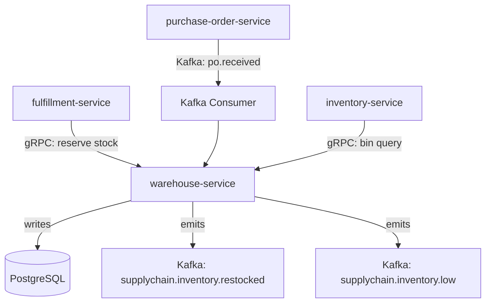

# warehouse-service

> Manages warehouse locations, bin/slot assignments, and all inbound and outbound stock movements.

## Overview

The warehouse-service is the physical inventory layer of ShopOS, tracking exactly where each SKU is stored within a warehouse facility. It models a hierarchy of warehouse → zone → aisle → bin and records every stock movement as an immutable ledger entry. Fulfillment and inventory services query this service to determine pick locations and available stock at a bin level.

## Architecture



## Tech Stack

| Component | Technology |
|---|---|
| Language | Go |
| Database | PostgreSQL |
| Protocol | gRPC |
| Migrations | golang-migrate |
| Build Tool | go build |
| Container | Docker (multi-stage, non-root) |

## Responsibilities

- Warehouse, zone, aisle, and bin/slot CRUD and capacity management
- Inbound stock receipt and putaway assignment
- Outbound stock reservation and release for fulfillment picks
- Stock movement ledger with full traceability (receipt, pick, transfer, adjustment)
- Low-stock threshold monitoring and alert event publishing
- Cycle count and physical inventory reconciliation support

## API / Interface

```protobuf
service WarehouseService {
  rpc CreateWarehouse(CreateWarehouseRequest) returns (Warehouse);
  rpc GetWarehouse(GetWarehouseRequest) returns (Warehouse);
  rpc ListBins(ListBinsRequest) returns (ListBinsResponse);
  rpc PutawayStock(PutawayRequest) returns (StockMovement);
  rpc ReserveStock(ReserveStockRequest) returns (ReservationConfirmation);
  rpc ReleaseReservation(ReleaseReservationRequest) returns (google.protobuf.Empty);
  rpc RecordStockMovement(StockMovementRequest) returns (StockMovement);
  rpc GetBinInventory(GetBinInventoryRequest) returns (BinInventory);
  rpc ListStockMovements(ListStockMovementsRequest) returns (ListStockMovementsResponse);
}
```

## Kafka Topics

| Topic | Direction | Description |
|---|---|---|
| `supplychain.po.received` | consume | Triggers putaway workflow on goods receipt |
| `supplychain.inventory.restocked` | publish | Emitted when a bin is replenished |
| `supplychain.inventory.low` | publish | Emitted when SKU stock falls below threshold |

## Dependencies

**Upstream (callers)**
- `fulfillment-service` — stock reservation and release
- `inventory-service` (catalog domain) — aggregate stock level queries

**Downstream (calls out to)**
- None (leaf service for physical stock data)

## Environment Variables

| Variable | Default | Description |
|---|---|---|
| `GRPC_PORT` | `50102` | Port the gRPC server listens on |
| `DB_HOST` | `localhost` | PostgreSQL host |
| `DB_PORT` | `5432` | PostgreSQL port |
| `DB_NAME` | `warehouse_db` | Database name |
| `DB_USER` | `warehouse_svc` | Database user |
| `DB_PASSWORD` | — | Database password (required) |
| `KAFKA_BROKERS` | `localhost:9092` | Comma-separated Kafka broker list |
| `LOW_STOCK_THRESHOLD_DEFAULT` | `10` | Default units below which low-stock event fires |
| `LOG_LEVEL` | `info` | Logging level |

## Running Locally

```bash
docker-compose up warehouse-service
```

## Health Check

`GET /healthz` → `{"status":"ok"}`

gRPC health: `grpc.health.v1.Health/Check` → `SERVING`
